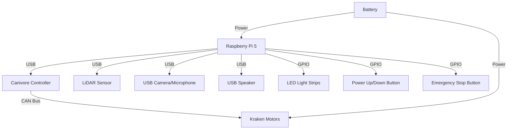
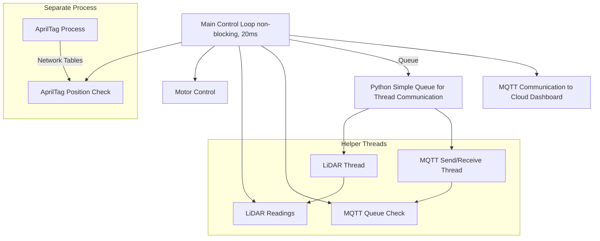
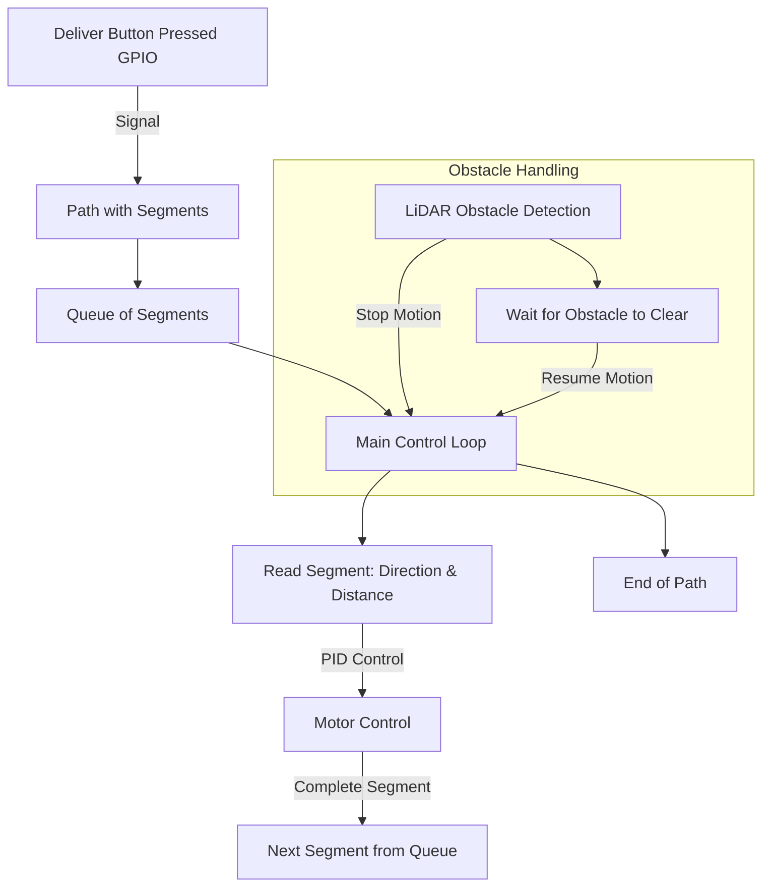
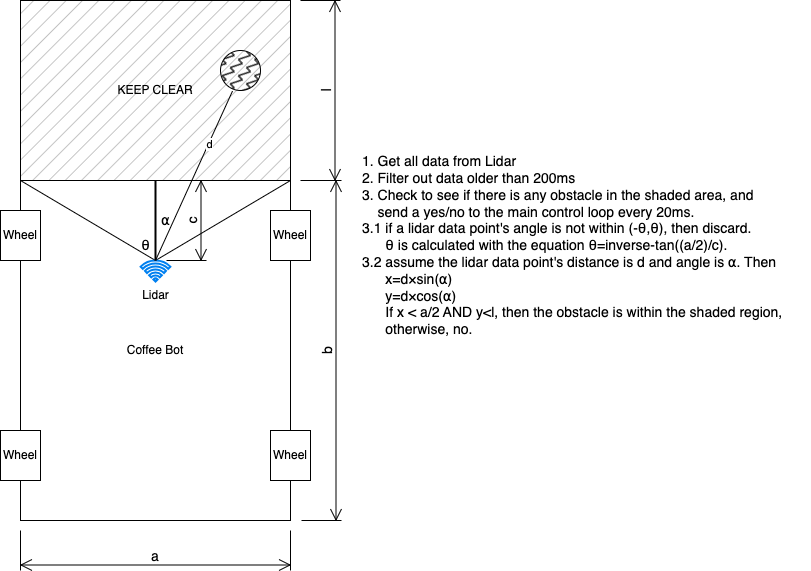

# CoffeeBot

CoffeeBot is an autonomous robot developed to deliver coffee from the Common Ground coffee shop to the high school office at Valley Christian High School. The bot is built using parts from FRC (FIRST Robotics Competition) and uses Python for all control systems. This repository contains the code for controlling CoffeeBot, including motor control, sensor integration, and communication with a cloud-based dashboard.

## Table of Contents
1. [Overview](#overview)
2. [System Architecture](#system-architecture)
3. [Hardware](#hardware)
4. [Software](#software)
5. [Installation](#installation)
6. [Usage](#usage)
7. [Features](#features)
8. [Contributing](#contributing)
9. [License](#license)

## Overview

CoffeeBot is designed to operate autonomously using a combination of dead reckoning, LiDAR for obstacle detection, and Apriltags for position calibration. It delivers coffee while monitoring its status and reporting back to a cloud-based dashboard via MQTT. The system is built for reliability, safety, and efficiency, using a custom Python-based control loop.

## System Architecture

The control system is based on a non-blocking loop running every 20 milliseconds. The loop handles:
- Motor control using CAN bus Kraken motors
- Obstacle detection via LiDAR
- AprilTag position calibration
- Communication with an MQTT server for status reporting

Blocking operations (e.g., sensor reads and MQTT communication) are handled by separate threads or processes. A Python simple queue is used for communication between the main control loop and helper threads.

## Hardware

- **Motors**: Kraken motors, driven by CAN bus through a Canivore controller
- **CPU**: Raspberry Pi 5
- **Sensors**: 
  - LiDAR for obstacle detection: Scanse Sweep [https://www.sparkfun.com/products/retired/14117]
  - AprilTag system for position calibration: PhotonVision Java Jar [https://photonvision.org/]
- **Power**: FRC battery

## Software



### Dependencies

- **CTRE Phoenix 6**: Used to control Kraken motors and read encoder data over CAN bus.
- **AprilTag Library**: Used to read AprilTag sensor data and calculate the robot’s position.
- **MQTT**: For communication with the cloud-based dashboard, using a Python MQTT library.
- **Python Threads and Queues**: For handling concurrent processes (e.g., sensor readings, MQTT communication).

### Python Control Loop

The main loop runs every 20 milliseconds (50Hz) and handles the following tasks:
- Driving motors based on calculated path (dead reckoning + AprilTag calibration).
- Reading LiDAR sensor to detect obstacles.
- Checking AprilTag sensor values and adjusting position.
- Communicating with MQTT to send/receive messages from the cloud.

### The Driving part

1. **Deliver Button (GPIO)**: Triggers the start of a delivery when pressed. It sends a signal to initiate the path execution.
   
2. **Path with Segments**: The path consists of multiple segments. Each segment defines a direction (like turning a specific angle) and a distance to travel.

3. **Queue of Segments**: Once the button is pressed, the segments are placed into a queue, which the control loop will process.

4. **Main Control Loop**: Reads each segment from the queue and executes it using PID control to handle motor movement for turning and driving.

5. **LiDAR Obstacle Detection**: If an obstacle is detected, the current motion stops. The control loop waits for the obstacle to clear, then resumes motion by executing the next segment.

6. **Motor Control**: Each segment is handled with PID control to ensure accurate movement and direction adjustments.

7. **Completion of Segments**: Once a segment is completed, the next one is fetched from the queue until the path is complete.


### Multi-threading

- **MQTT Communication**: Runs in a separate thread for sending and receiving status updates.
- **LiDAR Data**: Handled in a separate thread to ensure non-blocking operations.
- **Apriltag Detection**: Runs in a separate process, using network tables to retrieve values.

### Lidar object detection logic


### Odometry logic


## Installation

1. Clone the repository:
   ```bash
   git clone https://github.com/VCHSRobots/CoffeeBot.git
   cd CoffeeBot
   ```

2. Install the required dependencies:
   ```bash
   pip install -r requirements.txt
   ```
   Then install the lidar python library following [the lidar readme](lidar/README.md)

3. Set up hardware connections (CAN bus, sensors, etc.) as described in the [Hardware](#hardware) section.

4. Configure the MQTT server settings in the configuration file (`config/mqtt_config.json`).

## Usage

To run CoffeeBot:
1. Ensure all hardware is properly connected.
2. Execute the main Python script:
   ```bash
   python main.py
   ```

3. Monitor the robot's status via the cloud dashboard (see [CoffeeBot-Dashboard](https://github.com/VCHSRobots/CoffeeBot-dashboard)).

## Features

- **Autonomous Navigation**: Uses dead reckoning and Apriltag for position control.
- **Obstacle Detection**: LiDAR sensor to avoid collisions.
- **Real-time Status Reporting**: Communicates with a cloud-based dashboard using MQTT.
- **Custom Control System**: Python-based non-blocking control loop for efficient motor and sensor management.

## How to set up a Raspberry Pi to work with CTRE CANivore device and Kraken motors

1. I used Raspberry Pi 5.
2. I updated the OS and software packages to the latest by using the `bookworm` version of the OS, and then used `apt dist-upgrade` to update. My OS version is `Linux raspberrypi 6.6.47+rpt-rpi-2712 #1 SMP PREEMPT Debian 1:6.6.47-1+rpt1 (2024-09-02) aarch64 GNU/Linux`.
3. After doing the above, I was able to install the `canivore-usb` driver successfully. This was the most painful part. The `canivore-usb` package version I have is `1.13`.
4. After that, I used the "undocumented" `caniv` binary that comes with the `canivore-usb` package to set up the CANivore device. Here is the usage of the tool:

   ```
   (coffeebot) pi@raspberrypi:~/code/coffeebot $ caniv -h
   CTRE CANivore Command-line Interface
   Usage:
     caniv [OPTION...]

     -d, --device arg  Selects CANivore by serial number or name. Specify "*" to
                       select any device.
     -a, --any         Equivalent to [-d "*"]
     -v, --verbose     Print verbose messages
     -h, --help        Print this help message

    Action options:
         --version          Get version of this program
     -l, --list             List all discovered CANivore devices
     -s, --setup            Brings up the CANivore network
         --termination arg  Enables or Disables the CAN bus termination resistor
         --esp32 arg        Enables or Disables the ESP32 module
     -b, --blink            Blinks selected CANivore
     -r, --reset            Resets selected CANivore
     -n, --name arg         Sets name of selected CANivore. You must reset the
                            CANivore for the new name to take effect.
     -f, --flash arg        Field upgrades selected CANivore with crf file
     -i, --info             Solicit information from selected CANivore
         --license          Display license status of device
   ```

   I used `caniv -s -a` to set up the CANivore, and `caniv -l` to list CANivore devices.

5. Then, I used the default Python 3 (3.11), standard `venv` package to create a virtual environment for Python, installed the `phoenix6` package, and used the following Python program to run the first motor with ID 0:

   ```python
   from phoenix6 import controls, configs, hardware, signals, unmanaged
   import time

   talonfx = hardware.TalonFX(0)

   motor_request = controls.DutyCycleOut(0.0)
   motor_request.output = 0.2
   while True:
       # feed the enable signal, timeout after 100ms
       unmanaged.feed_enable(0.100)
       talonfx.set_control(motor_request)
       time.sleep(0.05)
   ```
## Contributing

We welcome contributions! Please follow these steps:
1. Fork the repository.
2. Create a new feature branch (`git checkout -b feature-branch`).
3. Commit your changes (`git commit -m 'Add new feature'`).
4. Push to the branch (`git push origin feature-branch`).
5. Create a pull request.

## License

This project is licensed under the MIT License - see the [LICENSE](LICENSE) file for details.
