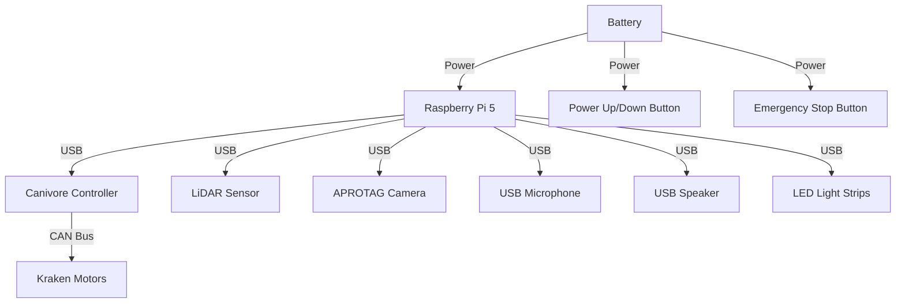
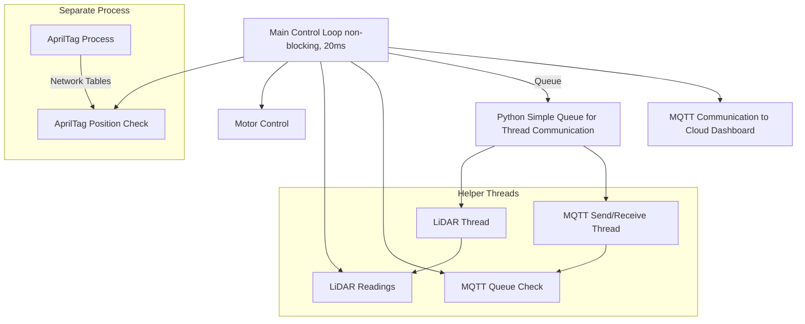

# CoffeeBot

CoffeeBot is an autonomous robot developed to deliver coffee from the Common Ground coffee shop to the high school office at Valley Christian High School. The bot is built using parts from FRC (FIRST Robotics Competition) and uses Python for all control systems. This repository contains the code for controlling CoffeeBot, including motor control, sensor integration, and communication with a cloud-based dashboard.

## Table of Contents
1. [Overview](#overview)
2. [System Architecture](#system-architecture)
3. [Hardware](#hardware)
4. [Software](#software)
5. [Installation](#installation)
6. [Usage](#usage)
7. [Features](#features)
8. [Contributing](#contributing)
9. [License](#license)

## Overview

CoffeeBot is designed to operate autonomously using a combination of dead reckoning, LiDAR for obstacle detection, and APROTAX sensors for position calibration. It delivers coffee while monitoring its status and reporting back to a cloud-based dashboard via MQTT. The system is built for reliability, safety, and efficiency, using a custom Python-based control loop.

## System Architecture

The control system is based on a non-blocking loop running every 20 milliseconds. The loop handles:
- Motor control using CAN bus Kraken motors
- Obstacle detection via LiDAR
- AprilTag position calibration
- Communication with an MQTT server for status reporting

Blocking operations (e.g., sensor reads and MQTT communication) are handled by separate threads or processes. A Python simple queue is used for communication between the main control loop and helper threads.

## Hardware

- **Motors**: Kraken motors, driven by CAN bus through a Canivore controller
- **CPU**: Raspberry Pi 5
- **Sensors**: 
  - LiDAR for obstacle detection: Scanse Sweep [https://www.sparkfun.com/products/retired/14117]
  - AprilTag system for position calibration: PhotonVision Java Jar [https://photonvision.org/]
- **Power**: FRC battery

## Software

### Dependencies

- **CTRE Phoenix 6**: Used to control Kraken motors and read encoder data over CAN bus.
- **AprilTag Library**: Used to read AprilTag sensor data and calculate the robot’s position.
- **MQTT**: For communication with the cloud-based dashboard, using a Python MQTT library.
- **Python Threads and Queues**: For handling concurrent processes (e.g., sensor readings, MQTT communication).

### Python Control Loop

The main loop runs every 20 milliseconds (50Hz) and handles the following tasks:
- Driving motors based on calculated path (dead reckoning + APROTAX calibration).
- Reading LiDAR sensor to detect obstacles.
- Checking AprilTag sensor values and adjusting position.
- Communicating with MQTT to send/receive messages from the cloud.

### Multi-threading

- **MQTT Communication**: Runs in a separate thread for sending and receiving status updates.
- **LiDAR Data**: Handled in a separate thread to ensure non-blocking operations.
- **APROTAX Detection**: Runs in a separate process, using network tables to retrieve values.

## Installation

1. Clone the repository:
   ```bash
   git clone https://github.com/VCHSRobots/CoffeeBot.git
   cd CoffeeBot
   ```

2. Install the required dependencies:
   ```bash
   pip install -r requirements.txt
   ```

3. Set up hardware connections (CAN bus, sensors, etc.) as described in the [Hardware](#hardware) section.

4. Configure the MQTT server settings in the configuration file (`config/mqtt_config.json`).

## Usage

To run CoffeeBot:
1. Ensure all hardware is properly connected.
2. Execute the main Python script:
   ```bash
   python main.py
   ```

3. Monitor the robot's status via the cloud dashboard (see [CoffeeBot-Dashboard](https://github.com/VCHSRobots/CoffeeBot-dashboard)).

## Features

- **Autonomous Navigation**: Uses dead reckoning and APROTAX for position control.
- **Obstacle Detection**: LiDAR sensor to avoid collisions.
- **Real-time Status Reporting**: Communicates with a cloud-based dashboard using MQTT.
- **Custom Control System**: Python-based non-blocking control loop for efficient motor and sensor management.

## Contributing

We welcome contributions! Please follow these steps:
1. Fork the repository.
2. Create a new feature branch (`git checkout -b feature-branch`).
3. Commit your changes (`git commit -m 'Add new feature'`).
4. Push to the branch (`git push origin feature-branch`).
5. Create a pull request.

## License

This project is licensed under the MIT License - see the [LICENSE](LICENSE) file for details.

---

That should give a comprehensive introduction and setup guide for your CoffeeBot Python repository! Let me know if you'd like to add anything else.
