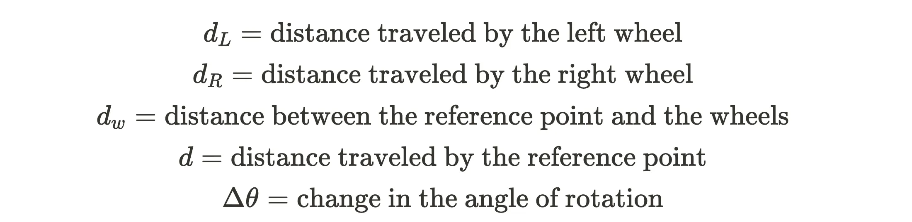

### dL, dR can be measured with encoder readings, and dw is known based on the robot design. Now we can calculate d and Δθ as follows

### based on the above calculation, we can calculate the absolute position and orientation with defined coordinate plane

